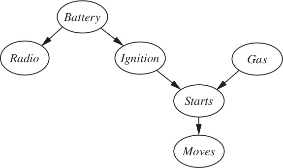

### Assignment 5: Probabilistic Inference and Learning

#### Due: Sunday Nov 8, 11:59pm.

#### Total: 70 points

In this assignment you’ll have three tasks to complete. The first is a set of pen-and-paper exercises, and the last two use existing software packages. The amount of raw coding you’ll need to do for this assignment is less than in previous assignments, but there’s some work to be done to get these packages up and running, and to figure out how to use them effectively. This is a really good skill to develop - there’s so many great AI and ML packages available, and getting comfortable with figuring out how to set them up, what their limitations are, and how to integrate them is really important.

1. **(20 points)** Probability exercises.

     a. A bag contains k fair coins and one two-headed coin. Without looking, you select a coin at random and toss it n
  times. All n tosses are heads. What is the probability that the coin
  is fair? Show your work.

    b. Joe Student comes to his professor and says that he forgot to bring his project to hand in, and wants to turn it
  in tomorrow without penalty. The professor knows that 1 time in 100,
  a student completes her assignment and forgets to bring it. The
  professor also knows that 50% of the time, a student who hasn't
  completed the assignment will say that they forgot it. Finally, the
  professor believes that 90% of the students in the class completed
  the assignment. 
  
    What is the probability that Joe Student actually completed the
    assignment? Show all relevant work. 

    c. (From Russell and Norvig)
  
    In your local nuclear power station, there is an alarm that senses when a temperature gauge exceeds a given threshold. The gauge measures the temperature of the core. 
    Consider the Boolean variables A (alarm sounds), F (alarm is faulty), and G (gauge is faulty) and the multivalued nodes R (gauge reading) and T (actual core temperature).
       
    1. Draw a Bayesian network for this domain, given that the gauge is more likely to fail when the core temperature gets too high.
    2. Is your network a polytree? Why or why not?
    3. Suppose that both R and T have two possible values:  normal and high; the probability that the gauge gives the correct temperature is x when it is working (and the probability of the wrong temp is therefore 1-x), but y when it is faulty. Give the conditional probability table associated with G.
    4. Suppose the alarm works correctly unless it is faulty, in which case it never sounds. Give the conditional probability table associated with A.
    5. Suppose the alarm and gauge are working and the alarm sounds. Calculate an expression for the probability that the temperature of the core is too high, in terms of the various conditional probabilities in the network.

2. **(20 points)** Pomegranate. In this exercise, you’ll be using [pomegranate](https://pomegranate.readthedocs.io/en/latest/index.html). Pomegranate has a lot of very cool 
features for probabilistic reasoning. In this exercise, we’ll just be working with the Bayesian network tool. (We’ll use HMMs later in the semester.) Pomegranate’s 
documentation can be found [here](https://pomegranate.readthedocs.io/en/latest/index.html): you can download it from the website, or (better) use your favorite installer (pip, conda) to install it.

I’ve provided an example of how to use pomegranate to set up the alarm network from R&N that we’ve discussed in class. You might also find [this example of a Bayesian network testing for tuberculosis](https://github.com/jmschrei/pomegranate/blob/master/examples/bayesnet_asia.ipynb), along with [this tutorial](https://www.norsys.com/tutorials/netica/secA/tut_A1.htm), helpful.

a. Please use pomegranate to encode this network. 

You may choose initial CPT values that seem reasonable to you.

b. Then add nodes for ColdWeather and Starter. If there is cold weather, the battery is less likely to be operational. If the starter is not functional, the car will not start.

c. Use Pomegranate to ask the following queries. Write a small test program that computes these and prints them out:
* Given that the car will not move, what is the probability that the battery is not working?
* Given that the radio is not working, what is the probability that the car will not start?
* Given that the battery is working, does the probability of the radio working change if we observe that the car has gas in it?
* Given that the car does not move, how does the probability of the ignition failing change if we observe that the car has gas in it?
* What is the probability that the car starts if the radio works and it has gas in it?

3. **(30 points)** Text classification with Naive Bayes. As we’ll discuss in class, Naive Bayes is an extremely effective learning algorithm for classifying 
text according to category or topic. For this task, you have three choices:

    1. You can use the [Naive Bayes tool included with scikit-learn](https://scikit-learn.org/stable/modules/naive_bayes.html) to build a classifier that 
    can classify articles by topic. You should use the [20-newsgroup dataset](https://scikit-learn.org/stable/datasets/index.html#the-20-newsgroups-text-dataset), and build a classifier 
    that can build a MultinomialNB model and predict the group that an article is from. [There is quite a bit of 
    detail](https://scikit-learn.org/stable/auto_examples/text/plot_document_classification_20newsgroups.html#sphx-glr-auto-examples-text-plot-document-classification-20newsgroups-py) in the scikit-learn documentation to show you how to do this. You are welcome and encouraged to use 
    code from past assignments as necessary. Your goal is to build a classifier that maximizes accuracy - to do so, you will need to think 
    about how to prepare your features - you can use the techniques from the tutorial, or add your own.
    
    2. NLTK also contains an implementation of Naive Bayes, [described here](https://www.nltk.org/book/ch06.html). You can use 
    this classifier, in conjunction with the tools developed in assignment 3, to implement and test Naive Bayes. The NLTK book 
    provides some guidance about how to do this. Use either the [Reuters corpus or the product review corpus](https://www.nltk.org/book/ch02.html) to build a 
    classifier that can predict an article’s category - you are welcome and encouraged to use code from previous assignments, as well as other NLTK tools, 
    such as stemmers or or POS taggers, as you see fit. Your goal is to build a classifier that maximizes accuracy - to do so, you will need to think about 
    how to prepare your features - you can use the techniques from the tutorial, or add your own.
    
    3. Write your own. If you would prefer, you can build a Naive Bayes classifier yourself. The basic algorithm is not hard - my implementation is about 75 not-very-compact 
    lines of Python. If you do this, you will want to deal with log-likelihood, and also think about a pre-processing step to filter your input text to remove stop words and 
    non-words. If you choose this option, you can use the [Enron dataset](http://www2.aueb.gr/users/ion/data/enron-spam/); these are [real emails collected as part of the Enron case](https://www.cs.cmu.edu/~./enron/) 
    and placed into the public domain. [Here is a pre-processed version](https://www.kaggle.com/venky73/spam-mails-dataset) - this dataset has been widely studied and analyzed,
     so you should be able to find other versions as well. You should start by building a classifier that can distinguish spam from ham, using any of the techniques we’ve learned 
     so far to assist you. If you are able to get this working, then try a harder task: see if you can distinguish between *users*. 
            
     Prepare a test script that demonstrates your classifier, and a short (~1 page) document that describes:
     * Which option you chose
     * Any design decisions that you made in implementing your classifier
     * Results of your experiments.
     * Ideas for further extension -how might you improve performance if you had more time/resources? Are there places where you see your classifier getting tripped up?

